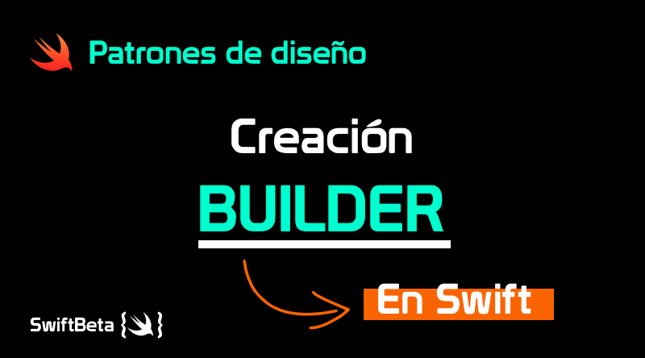

## Patron Builer
Bueno una explicacion punto por punto es innecesario en este caso ya que este ejercicio  fue realizado en un tallar por tanto seria estar redondando lo que se nos dijo ese  dia por eso lo que puedo dejar es un poco de concepto de que es el methodo builer.

se usa para permitir la creación de una variedad de objetos complejos desde un  
objeto fuente (Producto), el objeto fuente se compone de una variedad de partes  
que contribuyen individualmente a la creación de cada objeto complejo a través de 
 un conjunto de llamadas secuenciales a una implementación específica que extienda la 
  clase Abstract Builder. Así, cada implementación existente de Abstract Builder  
  construirá un objeto complejo Producto de una forma diferente deseada.

